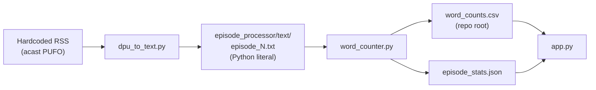
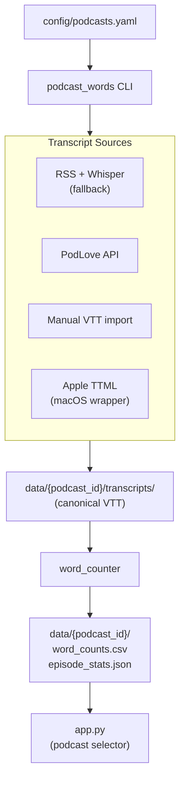
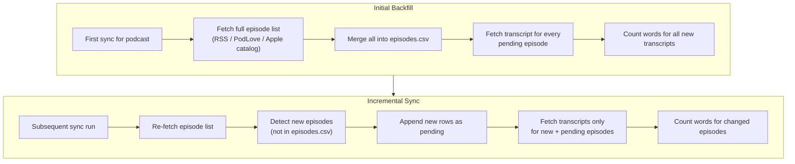

# Multi-Podcast Transcript Extension Plan

> Implementation status: **complete**. This document is the design plan that
> guided the multi-podcast refactor. All phases and success criteria below have
> been implemented and validated; see `README.md` for usage.

## Current State

Podcast_Words is a **German word-frequency tool** for podcast episodes: offline pipeline (transcribe → lemmatize → count) + Streamlit dashboard.



**Key constraints today:**
- All podcast-specific values are hardcoded in [`episode_processor/dpu_to_text.py`](../episode_processor/dpu_to_text.py) (feed URL, `UFO(\d+)` regex) and [`app.py`](../app.py) (title, file paths, default words)
- [`word_counter.py`](../episode_processor/word_counter.py) only reads Whisper output via `ast.literal_eval`
- No config, no tests, no VTT/PodLove/Apple support

---

## Target Architecture



**Design principles:**
- **Dual-mode import** — every source adapter supports (1) initial backfill of all existing published episodes and (2) incremental import when new episodes are published later; same `sync` command handles both
- **Complete episode catalog per podcast** — `episodes.csv` lists every known episode; backfill and incremental runs merge into the same catalog
- **VTT as canonical on-disk format** for all new transcripts (Whisper legacy `.txt` and other formats supported via adapters)
- **Per-podcast data isolation** under `data/{podcast_id}/`
- **Per-podcast transcript source** — each podcast config declares its own source(s)
- **CLI-first** for config, import, and sync; Streamlit is read-only with a podcast selector in v1
- **Minimal refactor** — keep spaCy counting logic, Whisper pipeline, and Streamlit charts intact

---

## Dual-Mode Import (Backfill + Incremental)

Per AGENTS.md: support **import of all existing episodes** as well as **import of new published episodes**. This is a core requirement, not an optional flag.



### Unified sync orchestrator

[`podcast_words/pipeline/episode_sync.py`](../podcast_words/pipeline/episode_sync.py) implements both modes:

| Phase | What happens | When |
|-------|--------------|------|
| **Discover** | Fetch full published episode list from source; upsert into `episodes.csv` | Every sync run |
| **Backfill** | Fetch transcripts for all episodes with `state=pending` | First run (empty catalog) or `--backfill` |
| **Incremental** | Fetch transcripts only for episodes added since last sync or still `pending` | Every subsequent sync run |
| **Count** | Run word counter for episodes with new/changed transcripts | When `--count` (default on sync) |

New episodes are detected by comparing the remote episode list against `episodes.csv` (match on `source_id` or `number`+`title`). Newly discovered rows get `state=pending` and are processed in the same run — no separate command needed.

### CLI

```bash
# First time for a new podcast: backfills entire catalog automatically
python -m podcast_words sync --podcast freakshow

# Regular use: picks up newly published episodes only
python -m podcast_words sync --podcast freakshow

# Re-attempt failed/missing transcripts across full catalog
python -m podcast_words sync --podcast freakshow --backfill

# Cron-friendly: discover new + import + count (typical weekly job)
python -m podcast_words sync --podcast pufo --count
```

Optional metadata in `data/{id}/sync_state.json`:
```json
{ "last_sync_at": "2026-06-06T12:00:00Z", "last_episode_count": 467 }
```

### Per-source behavior

| Source | Backfill (all existing) | Incremental (new published) |
|--------|-------------------------|----------------------------|
| **PodLove** | `GET /episodes?status=publish` → fetch transcript for each | Re-fetch list; import transcript for episodes not in catalog |
| **RSS + Whisper** | Parse full RSS; Whisper-transcribe all without local VTT | Parse RSS; transcribe only new enclosure URLs |
| **Apple** | iTunes Lookup by `podcast_id` → fetch TTML for every episode | Re-lookup show; fetch transcripts only for new episode IDs |
| **Manual** | N/A (user provides files) | User runs `import --episode N` for a single new episode |

All sources write to the same `episodes.csv` + `transcripts/` layout so the word counter and Streamlit app work identically regardless of how episodes arrived.

---

## Phase 1: Foundation (config + data layout + migration)

### 1.1 Podcast configuration schema

Add [`config/podcasts.yaml`](../config/podcasts.yaml):

```yaml
podcasts:
  pufo:
    name: "Das Podcast-Ufo"
    language: de
    episode_id:
      type: regex          # regex | podlove_number | sequential
      pattern: "UFO(\\d+)"
    sources:
      - type: whisper_rss
        feed_url: "https://feeds.acast.com/public/shows/podcast-ufo"
    defaults:
      search_words: [eimer, münze, cent]

  freakshow:
    name: "Freak Show"
    language: de
    episode_id:
      type: podlove_number
    sources:
      - type: podlove
        api_base: "https://freakshow.fm/wp-json/podlove/v2"
    defaults:
      search_words: []

  tribuenengespraech:
    name: "Rasenfunk – Tribünengespräch"
    language: de
    episode_id:
      type: sequential          # assign 1, 2, 3… by release date
    sources:
      - type: apple
        podcast_id: "916269734"  # from podcasts.apple.com/.../id916269734
        country: DE
    defaults:
      search_words: []
```

Add [`podcast_words/config.py`](../podcast_words/config.py) to load/validate YAML (plain dataclasses + validation).

Each podcast resolves paths via a small helper:

| Path | Purpose |
|------|---------|
| `data/{id}/episodes.csv` | **Complete episode catalog** — every episode for this podcast (number, title, source IDs, transcript state) |
| `data/{id}/transcripts/` | Canonical `.vtt` files (`episode_{n}.vtt`) |
| `data/{id}/word_counts.csv` | Word matrix (one column per cataloged episode with a transcript) |
| `data/{id}/episode_stats.json` | Stats for all counted episodes |

### 1.1b Episode catalog schema

`episodes.csv` is the source of truth for what episodes exist per podcast:

| Column | Purpose |
|--------|---------|
| `number` | Display/analysis episode ID (PUFO number, PodLove `number`, etc.) |
| `title` | Episode title |
| `link` | Audio/enclosure URL (RSS) or episode page URL |
| `source_id` | External ID (PodLove post ID, **Apple episode trackId**) |
| `published_at` | RSS/API publication date (for ordering new-episode detection) |
| `state` | `done` \| `pending` \| `no_transcript` \| `skip` \| `error` |
| `transcript_source` | `whisper` \| `podlove` \| `apple` \| `manual` \| `vtt_import` |
| `discovered_at` | When this row was first added to catalog |

The sync orchestrator (see **Dual-Mode Import** above) owns discover/backfill/incremental logic — this section defines the data it reads and writes.

### 1.2 Migrate existing PUFO data (all 464+ episodes)

One-time migration script [`scripts/migrate_pufo.py`](../scripts/migrate_pufo.py):
- Move/copy root `word_counts.csv` and `episode_stats.json` → `data/pufo/`
- Move `episode_processor/episodes.csv` → `data/pufo/episodes.csv`; set `state=done` where a transcript exists
- Register all existing Whisper transcripts via legacy adapter (no re-transcription needed)
- Batch-convert legacy `.txt` → `.vtt` under `data/pufo/transcripts/` so all episodes share one format going forward
- Verify episode count parity: catalog rows == transcript files == CSV columns == stats entries

### 1.3 Package layout

```
podcast_words/
  __init__.py
  config.py
  models.py          # TranscriptCue, Transcript
  catalog.py         # episodes.csv read/write
  cli.py             # entry point: python -m podcast_words
  transcripts/
    vtt.py           # parse/write WebVTT (canonical)
    srt.py
    ttml.py          # Apple TTML
    plain.py
    whisper_legacy.py
    loader.py        # dispatch by extension/content
  sources/
    rss.py
    podlove.py
    apple.py         # macOS FetchTranscript wrapper
    apple_catalog.py # iTunes Lookup discovery
    whisper.py
  pipeline/
    word_counter.py
    episode_sync.py  # dual-mode orchestrator
    manual_import.py
```

Add [`pyproject.toml`](../pyproject.toml) with optional extras: `[whisper]`, `[podlove]`, `[apple]`.

---

## Phase 2: Unified transcript layer + manual import

### 2.1 Transcript model

[`podcast_words/models.py`](../podcast_words/models.py):

```python
@dataclass
class TranscriptCue:
    start_ms: int
    end_ms: int
    text: str
    voice: str | None = None

@dataclass
class Transcript:
    cues: list[TranscriptCue]
    def plain_text(self) -> str: ...   # for word counting
    def to_vtt(self) -> str: ...
```

### 2.2 Transcript format support

| Format | Extension | Adapter | Notes |
|--------|-----------|---------|-------|
| WebVTT | `.vtt` | `vtt.py` | Canonical on-disk format |
| Whisper legacy | `.txt` | `whisper_legacy.py` | Existing PUFO output |
| Apple TTML | `.ttml` | `ttml.py` | From Apple fetch wrapper |
| SRT | `.srt` | `srt.py` | Convert on import → VTT |
| Plain text | `.txt` (non-literal) | `plain.py` | Whole-file text, no timestamps |

All adapters produce the same `Transcript` model; import always saves canonical VTT.

### 2.3 CLI: manual import

```bash
python -m podcast_words import --podcast pufo --episode 420 --file /path/to/episode.vtt
python -m podcast_words import --podcast pufo --dir /path/to/folder/  # optional bulk
```

1. Auto-detect format from extension (VTT, SRT, TTML, plain text, Whisper legacy)
2. Parse → validate episode ID (from `--episode` or filename `episode_420.*`)
3. Save canonical VTT to `data/{podcast_id}/transcripts/episode_{n}.vtt`
4. Upsert row in `episodes.csv` — `state=done`, `transcript_source=manual`
5. Optionally run word counter immediately (`--count`)

### 2.4 Refactor word counter

[`podcast_words/pipeline/word_counter.py`](../podcast_words/pipeline/word_counter.py):
- Accept `--podcast {id}` (loads config for language/spaCy model)
- Process **all episodes in catalog** that have a transcript file and are not yet in `word_counts.csv`
- Use `Transcript.plain_text()` instead of format-specific parsing
- Write outputs to per-podcast data dir; `episode_stats.json` covers every counted episode
- `--rebuild` flag to re-count all episodes

---

## Phase 3: PodLove API integration

[`podcast_words/sources/podlove.py`](../podcast_words/sources/podlove.py):

| Step | Endpoint | Purpose |
|------|----------|---------|
| List episodes | `GET {api_base}/episodes?status=publish` | Discover episodes; use `id`, `title` |
| Fetch transcript | `GET {api_base}/transcripts/{episode_id}` | Returns JSON with a `transcript` array of timed paragraphs |
| Check availability | 404 on transcript endpoint | Mark episode `no_transcript` |

The live freakshow.fm endpoint returns `{ "transcript": [{ start_ms, end_ms, voice, text }] }`; the client builds cues directly from this and falls back to raw VTT if returned.

---

## Phase 4: Apple Podcasts — import by Podcast ID

You configure only the **Podcast ID** (show ID); episode discovery and transcript fetch are automatic.

| ID | Where to find | Used for |
|----|---------------|----------|
| **Podcast ID** (show) | URL path `.../id916269734` → `916269734` | Config `podcast_id`; episode discovery |
| **Episode ID** | Share link query `?i=...` | Internal `source_id`; passed to FetchTranscript |

### 4.1 Episode discovery from Podcast ID

[`podcast_words/sources/apple_catalog.py`](../podcast_words/sources/apple_catalog.py) — public iTunes Lookup, no auth:

```
GET https://itunes.apple.com/lookup?id={podcast_id}&country={country}&media=podcast&entity=podcastEpisode&limit=200
```

- Extract `trackId` (→ `source_id`), `trackName`, `releaseDate`, `episodeUrl`
- Assign display `number` sequentially by `releaseDate` (oldest = 1), or via title regex

### 4.2 Transcript fetch (macOS wrapper)

[`podcast_words/sources/apple.py`](../podcast_words/sources/apple.py) wraps the vendored
[FetchTranscript](https://github.com/dado3212/apple-podcast-transcript-downloader) binary
(`tools/apple/`):
- macOS 15.5+ only; requires the Apple Podcasts app signed in
- For each episode `source_id`: `FetchTranscript {episode_id} --cache-bearer-token` → `.ttml`
- Episodes without a transcript → `state=no_transcript`

### 4.3 TTML → VTT converter

[`podcast_words/transcripts/ttml.py`](../podcast_words/transcripts/ttml.py): parse Apple TTML
(timed `<p>`/`<span>` with `begin`/`end`, namespaces, agents) → WebVTT cues. Raw `.ttml`
kept under `transcripts/raw/` as backup.

---

## Phase 5: Refactor ingestion pipeline + update Streamlit app

### 5.1 Generalize `dpu_to_text.py`

- RSS fetching → [`podcast_words/sources/rss.py`](../podcast_words/sources/rss.py)
- Whisper logic → [`podcast_words/sources/whisper.py`](../podcast_words/sources/whisper.py)
- Output: write VTT instead of Python-literal `.txt`
- Per-episode state tracked in `episodes.csv`
- Legacy scripts kept as thin deprecated wrappers calling the new CLI

### 5.2 Streamlit app — podcast selector

[`app.py`](../app.py):
- Sidebar `st.selectbox` of podcasts from `config/podcasts.yaml`
- Full reload of word matrix, stats, and charts for the selected podcast
- Podcast name as title; transcript coverage shown from `episodes.csv` state counts
- Per-podcast `defaults.search_words`; `@st.cache_data` keyed by `podcast_id`
- Only podcasts with a built `word_counts.csv` appear in the selector

---

## Phase 6: Tests + documentation

### 6.1 Tests

[`tests/`](../tests/) with pytest:

| Test file | Coverage |
|-----------|----------|
| `test_vtt_parser.py` | Sample VTT fixtures → cues, round-trip |
| `test_ttml_parser.py` | Sample TTML → VTT |
| `test_whisper_legacy.py` | Existing `.txt` format → Transcript |
| `test_word_counter.py` | Small fixture transcripts → expected counts |
| `test_episode_sync.py` | Backfill vs incremental: mock remote lists, verify only new episodes processed |
| `test_apple_catalog.py` | Mock iTunes Lookup by Podcast ID → full episode list |
| `test_podlove_client.py` | Mock HTTP responses for episode list + transcript fetch |
| `test_config.py` | YAML loading + validation |

No GPU/Whisper integration tests in CI.

### 6.2 Documentation

[`README.md`](../README.md), translated to English:
- Config format and directory layout
- CLI command reference for each source type
- Apple Podcast ID setup and macOS requirements
- Migration steps for the existing PUFO deployment
- PodLove setup
- Disclaimer: this fork was adjusted with Cursor AI; LLM versions used

---

## Success Criteria

- [x] PUFO migration preserves all existing episodes; word counts match pre-migration
- [x] First `sync` for a new podcast backfills **all existing** published episodes and their transcripts
- [x] Subsequent `sync` runs import **only newly published** episodes without re-processing done ones
- [x] `--backfill` retries all `pending`/`no_transcript` episodes across the full catalog
- [x] Apple sync: given only `podcast_id` in config, discovers all episodes and backfills transcripts (macOS 15.5+)
- [x] Subsequent Apple sync imports only newly published episodes
- [x] Manual import adds/updates a single episode transcript and appears in word counts
- [x] Streamlit podcast selector switches datasets; charts show the full episode range for the selected podcast
- [x] Core parsers, episode sync (backfill + incremental), and PodLove client have unit tests
